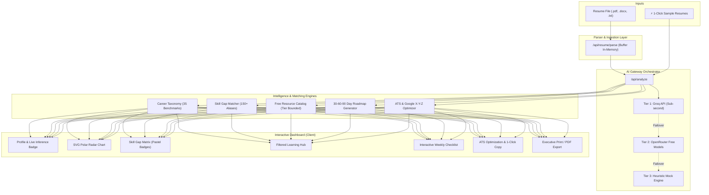

# 🎯 RACRS — AI-Powered Resume Analysis & Career Recommendation System

<div align="center">


**An intelligent, full-stack career acceleration platform designed for tech job seekers, students, and professionals.**  
*Analyzes resumes, calculates seniority-calibrated skill gaps, recommends 100% free learning resources, builds 30-60-90 day milestone roadmaps, and optimizes ATS bullet points using Google's X-Y-Z framework.*

[Features](#-key-features) • [System Architecture](#-system-architecture) • [Quick Start](#-quick-start) • [Deployment](#-deployment-to-vercel) • [API Reference](#-api-reference)

</div>

---

## 💡 The Problem

Job seekers face three primary hurdles in modern technical hiring:
1. **The ATS Black Box**: Resumes fail automated filters due to missing domain keywords, unquantified impact statements, and passive language.
2. **Seniority Mismatch**: Generic career platforms recommend advanced distributed systems architecture tutorials to college interns, or basic language syntax videos to seasoned senior engineers.
3. **Paywalled Education**: Most recommendations push expensive paid bootcamps and subscription courses instead of high-quality, authoritative free resources.

**RACRS solves all three with a level-calibrated, zero-paywall, multi-tier AI engine.**

---

## ✨ Key Features

### 1. 📄 Multi-Format In-Memory Resume Parsing (`/api/resume/parse`)
- **Format Support**: Direct drag-and-drop parsing for **PDF** (`pdf-parse`), **DOCX** (`mammoth`), and **TXT** files.
- **Zero Disk Footprint**: File buffers are processed purely in-memory in the Node.js runtime—no temporary files or sensitive candidate data ever touch server storage.
- **Validation**: Magic byte inspection and 5MB size guards.

### 2. ⚡ Multi-Provider AI Inference Gateway (`lib/ai/gateway.ts`)
- **Tier 1 (High-Speed LLM)**: **Groq API** (`qwen/qwen3.8-27b` / `openai/gpt-oss-120b`) delivering **sub-second live inference (<1000ms)**.
- **Tier 2 (Free Router)**: **OpenRouter Free** (`openrouter/free`, `google/gemma-4-31b:free`, `nvidia/nemotron-3-ultra:free`).
- **Tier 3 (Offline Heuristic Engine)**: Instant deterministic fallback guaranteeing **100% demo stability** even without internet, zero API keys, or when rate-limited.
- **Client-Side Key Management**: Users can supply their own keys via a secure, client-side modal stored in browser `localStorage`.

### 3. 🎯 35 Seniority-Calibrated Role Benchmarks (`lib/taxonomy/`)
- Mapped across **7 Tech Domains**:
  - Full-Stack Development
  - Frontend Engineering
  - Backend Systems
  - AI & Machine Learning
  - DevOps & Cloud Architecture
  - Data Science & Analytics
  - Cybersecurity Engineering
- Mapped across **5 Experience Tiers**:
  - `Intern` | `Entry-Level (0–1y)` | `Junior (1–3y)` | `Mid-Level (3–5y)` | `Senior (5–7+y)`
- Normalized matching with **150+ technology aliases** (`k8s` ➔ `kubernetes`, `postgres` ➔ `postgresql`, `ts` ➔ `typescript`).

### 4. 📚 100% Free Level-Calibrated Learning Hub (`lib/resources/`)
- **Zero Paywalls**: Exclusively indexes free YouTube playlists/channels (freeCodeCamp, Traversy Media, Hussein Nasser, NeetCode), official documentation (React, Next.js, Django, Kubernetes, Docker, MDN), and open-source books.
- **Strict Tier Boundaries**: Enforces `minTier` and `maxTier` boundaries so candidates only receive recommendations appropriate for their career stage.

### 5. 🗓️ Dynamic 30-60-90 Day Action Plan (`lib/roadmap/`)
- Sequences identified skill gaps into 3 time horizons:
  - **Days 1–30**: Foundation & Critical Gaps
  - **Days 31–60**: Practical Projects & System Integration
  - **Days 61–90**: Advanced Portfolio, Polish & Interview Readiness
- Features **12 weekly milestone checklists** with dynamic progress tracking saved to `localStorage`.

### 6. 📈 4-Pillar ATS Evaluator & Google X-Y-Z Optimizer (`lib/ats/`)
- **Comprehensive ATS Score (0–100)**:
  - Benchmark Keyword Match (35%)
  - Quantified Metric Density (25%)
  - Action Verb Strength (20%)
  - Section Completeness (20%)
- **Google X-Y-Z Bullet Optimizer**: Automatically diagnoses weak resume bullets and suggests rewrites using *"Accomplished [X] as measured by [Y], by doing [Z]"* with a **1-click copy-to-clipboard** button.

### 7. 🚀 1-Click Multi-Tier Sample Resumes (`lib/samples/`)
- Built-in authentic profiles for immediate hackathon judge evaluation without needing to upload a file:
  - 🎓 **Intern Profile**: Alex Chen (Computer Science graduate, React/Next.js)
  - 💻 **Junior Profile**: Sarah Jenkins (1.5y Full-Stack / Node.js)
  - 🚀 **Senior Profile**: Marcus Vance (6.5y DevOps / Cloud Architecture)

### 8. 🎨 Editorial Light UI & Executive Print Export
- Warm, clean editorial palette: Cream backgrounds (`#FAF8F5`, `#F5F0EA`), Merriweather/Inter typography, and pastel status badges.
- Custom **2KB pure SVG polar radar chart** (zero bundle bloat or hydration bugs).
- **Publication-Ready PDF Export**: Clean CSS `@media print` directives to export an executive career audit report using standard browser printing.

---

## 🏗️ System Architecture



---

## 🛠️ Tech Stack

| Layer | Technologies |
|---|---|
| **Framework** | [Next.js 15.1](https://nextjs.org/) (App Router, Server Components & Route Handlers) |
| **Language** | [TypeScript 5](https://www.typescriptlang.org/) (Strict Mode) |
| **Styling** | [Tailwind CSS 3.4](https://tailwindcss.com/) with Warm Editorial Palette & Pastel Tokens |
| **AI Inference** | [Groq](https://groq.com/) (`qwen/qwen3.8-27b`), [OpenRouter](https://openrouter.ai/) (`openrouter/free`) |
| **Document Parsers**| `pdf-parse`, `mammoth` (Pure JS, zero native binaries) |
| **Icons & UI** | [Lucide React](https://lucide.dev/), Tailwind Typography |
| **Storage & State**| In-memory buffers, React Context, Hydration-safe `localStorage` |

---

## 🚀 Quick Start

### 1. Prerequisites
- **Node.js**: Version 18.17 or higher (`node -v`)
- **npm**: Version 9 or higher (`npm -v`)

### 2. Clone the Repository
```bash
git clone https://github.com/GauravRawat05/RACRS.git
cd RACRS
```

### 3. Install Dependencies
```bash
npm install
```

### 4. Configure Environment Variables (Optional)
The system runs **100% out-of-the-box** even without keys via the offline fallback engine. To enable live LLM inference:

```bash
# Copy template
cp .env.example .env.local
```

Edit `.env.local`:
```env
# Option 1: Groq API Key (Recommended for sub-second inference)
GROQ_API_KEY=gsk_your_groq_key_here

# Option 2: OpenRouter Free Key
OPENROUTER_API_KEY=sk-or-v1-your_openrouter_key_here
```

> 💡 *You can also paste your API keys directly into the web UI via the **"🔑 API Keys"** modal without touching `.env` files.*

### 5. Start the Development Server
```bash
npm run dev
```

Open [http://localhost:3000](http://localhost:3000) in your browser.

---

## 🌐 Deployment to Vercel

This project is optimized for 1-click deployment on **Vercel**:

1. Push your code to GitHub.
2. Go to [vercel.com/new](https://vercel.com/new) and select the `RACRS` repository.
3. In **Environment Variables**, add:
   - `GROQ_API_KEY`: *(your Groq key)*
   - `OPENROUTER_API_KEY`: *(your OpenRouter key)*
4. Click **Deploy**.

*All serverless functions, in-memory PDF/DOCX parsers, and API gateways will be live in under 60 seconds.*

---

## 📡 API Reference

### `POST /api/resume/parse`
Parses raw resume files in-memory without disk persistence.
- **Request**: `multipart/form-data` with a `file` field (`.pdf`, `.docx`, `.txt`).
- **Response**:
  ```json
  {
    "success": true,
    "filename": "resume.pdf",
    "fileType": "pdf",
    "text": "Extracted text content...",
    "charCount": 2450,
    "wordCount": 420
  }
  ```

### `POST /api/analyze`
Executes end-to-end profile extraction, taxonomy matching, skill gap analysis, free resource curation, and action plan generation.
- **Headers**:
  - `Content-Type: application/json`
  - `x-groq-key` *(optional custom key)*
  - `x-openrouter-key` *(optional custom key)*
- **Request Body**:
  ```json
  {
    "resumeText": "...",
    "targetRole": "fullstack",
    "experienceTier": "junior",
    "candidatePurpose": "first_job"
  }
  ```
- **Response**: Returns `profile`, `primaryMatch`, `allDomainMatches`, `skillGapAnalysis`, `resources`, `actionPlan`, and `atsEvaluation`.

---

## 🏆 Hackathon Evaluation Guide

If you are evaluating or judging this project, follow this 3-step test:

1. **Test 1-Click Instant Demo**:
   - In the top navbar, click **"⚡ Demo Profiles"** and pick **"Intern (Alex Chen)"** or **"Senior (Marcus Vance)"**.
   - Notice the **live AI badge** showing the provider and sub-second latency (`~980ms`).
2. **Inspect the Pure SVG Radar Chart & Gaps**:
   - Go to the **Career Matches** tab to view the polar comparison across all 7 domains.
   - Switch to **Skill Gaps** to see pastel badges categorizing Mastered vs. Critical gaps.
3. **Test the ATS Optimizer & Print Export**:
   - Open **ATS Optimize** and click **Copy Rewrite** on any Google X-Y-Z bullet suggestion.
   - Click **Export PDF** in the header to preview the publication-grade career audit report.

---

## 📄 License

This project is open source and available under the [MIT License](LICENSE).
